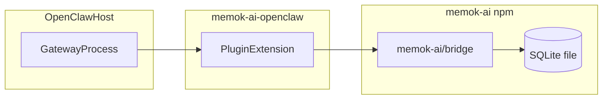
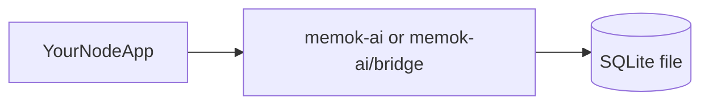

# memok-ai

English | [简体中文](./README.zh-CN.md) · Website: [memok-ai.com](https://www.memok-ai.com/) · Mirror (中文文档 / 境内安装): [Gitee](https://gitee.com/wik20/memok-ai)

**OpenClaw plugin (separate repo):** [galaxy8691/memok-ai-openclaw](https://github.com/galaxy8691/memok-ai-openclaw) — installs this package as `memok-ai-core`, imports the stable surface from **`memok-ai-core/bridge`**, and loads only the thin gateway extension.

> **If you came from the plugin docs:** install scripts, `openclaw memok setup`, and **gateway / plugin API versions** are maintained in **[memok-ai-openclaw](https://github.com/galaxy8691/memok-ai-openclaw)**. **This README** focuses on the **`memok-ai` npm library**: SQLite layout, `MemokPipelineConfig`, and how **your own Node.js process** calls `memok-ai` or `memok-ai/bridge`.

### How the OpenClaw plugin uses this core

The gateway loads the extension; the extension depends on **`memok-ai`** (often published under the dependency name `memok-ai-core`) and calls the **bridge** APIs. Your SQLite file path is still configured in the plugin / host layer.



**Without OpenClaw** (your API server, worker, or CLI):



`memok-ai` is a Node.js + TypeScript memory pipeline for long text and conversations.
It extracts structured memory units with OpenAI-compatible LLM APIs and stores them in SQLite for recall, reinforcement, and dreaming workflows.

## What It Does

- End-to-end article pipeline (`article-word-pipeline`) that outputs stable JSON tuples
- SQLite import tools for `words`, `normal_words`, `sentences`, and link tables
- Dreaming pipeline (`dreaming-pipeline`) that runs `predream` + story-word-sentence loops
- OpenClaw plugin for incremental conversation persistence and memory recall
- Interactive plugin setup (`openclaw memok setup`) for provider/model/schedule configuration

**Evaluation (tested):** With the OpenClaw plugin recall/report flow, effective memory utilization (candidate memories that were actually reflected in assistant replies) **exceeded 95%** in our runs. Your results will depend on model, task, and sampling settings.

### What the OpenClaw plugin does for you

- Per-turn recall: sampled candidates can be injected before each reply, so long threads stay on track without pasting full history every time.
- Reinforcement: calling `memok_report_used_memory_ids` bumps weights for memories you actually used, so frequent facts stay warm.
- Dreaming / predream: optional scheduled jobs run decay, merges, and cleanup—more like maintenance passes over a graph than a pure append-only log.

### How this differs from embedding-only stacks

| | memok-ai | Typical hosted vector DB |
| --- | --- | --- |
| Deployment | SQLite on your machine | Cloud API + billing |
| Recall signal | Word / normalized-word graph, weights, sampling | Embedding similarity |
| Explainability | Structured rows you can inspect | Mostly similarity scores |
| Privacy | Data stays local by default | Usually leaves your host |

That is a trade-off, not a universal “better/worse” on retrieval quality.

### Notes from real OpenClaw use

Heavy users report coherent follow-up across sessions (e.g. performance work, architecture, release tooling), stable feedback when citing memories, and predream/dreaming behaving as expected once scheduled. Active databases in the wild have reached on the order of ~1k sentences and 100k+ link rows—enough to exercise recall at non-trivial scale; your numbers will differ.

Informal timing on typical local setups (SSD, modest DB size) is often on the order of ~10² ms to persist a turn and sub-100 ms for recall queries—indicative only, not a SLA. Informal “recall accuracy %” figures from the community are anecdotes unless you reproduce them on your workload.

In short: memok targets an associative, reinforceable, optionally forgetful loop without managing embedding models or a separate vector service—closer to a structured “notebook graph” than a generic semantic index.

## Requirements

- Node.js **≥20** (LTS recommended)
- npm

**OpenClaw users:** supported gateway and plugin API versions are documented in **[memok-ai-openclaw](https://github.com/galaxy8691/memok-ai-openclaw)** (this core repo does not pin them in `package.json`).

Install dependencies (when hacking **this** repository):

```bash
npm install
```

**First-time install note:** a cold `npm install` here is dominated by **`better-sqlite3`** (native prebuild/compile) plus normal JS deps—often **a few minutes**, depending on network and disk. Avoid `--loglevel verbose` for day-to-day installs (it floods the terminal). The repo `.npmrc` points at **npmmirror** and disables audit calls that Chinese mirrors do not implement. Repeat installs are much faster with a warm npm cache.

## Installation

### 1) Work from a clone (library development)

```bash
npm install
npm run build
npm test
```

**Development workflow**

- `npm install` — also runs **`prepare` → `npm run build`** (see [package.json](package.json)), so TypeScript is emitted to `dist/` immediately.
- **`npm run build`** — `tsc` only; use after editing `src/` if you skipped install.
- **`npm test`** — Vitest; some tests call real LLMs when `OPENAI_API_KEY` is set (see [CONTRIBUTING.md](./CONTRIBUTING.md)).
- **`npm run ci`** — Biome + build + tests (same as typical CI).

This package does **not** read `.env` files for its own tests; export variables in your shell or use your editor’s env mechanism.

### 2) Install from npm (use as a library)

Published package: [`memok-ai` on npm](https://www.npmjs.com/package/memok-ai).

```bash
npm install memok-ai
```

```ts
// Full API surface (pipelines, SQLite helpers, types)
import {
  articleWordPipelineV2,
  buildPipelineContext,
} from "memok-ai";

// Stable subset for gateways / OpenClaw-style hosts
import {
  articleWordPipeline,
  dreamingPipeline,
} from "memok-ai/bridge";
```

Bridge entrypoints (`articleWordPipeline`, `dreamingPipeline`, etc.) take a full `MemokPipelineConfig` (or extended types such as `DreamingPipelineConfig`). For low-level pipelines that accept `{ ctx }`, import `buildPipelineContext` from the main `memok-ai` package and pass the resulting `PipelineLlmContext`.

```ts
import { articleWordPipeline } from "memok-ai/bridge";

await articleWordPipeline(longText, {
  dbPath: "/path/to/memok.sqlite",
  openaiApiKey: process.env.OPENAI_API_KEY!,
  openaiBaseUrl: process.env.OPENAI_BASE_URL,
  llmModel: "gpt-4o-mini",
  llmMaxWorkers: 4,
  articleSentencesMaxOutputTokens: 8192,
  coreWordsNormalizeMaxOutputTokens: 32768,
  sentenceMergeMaxCompletionTokens: 2048,
});
```

- Requires **Node.js ≥20** (same as this repo).
- **`better-sqlite3`** is a native dependency: first install may compile or download prebuilds (similar to cloning this repo and running `npm install`).
- **Libraries**: construct `MemokPipelineConfig` yourself (TOML, `ConfigService`, etc.) and pass it into bridge APIs.

The OpenClaw plugin repo may list this package under an alias such as `memok-ai-core`; the registry name remains **`memok-ai`**.

### Use in your own Node.js project

1. **`npm install memok-ai`** in your application (not necessarily in this repo).
2. **Pick `dbPath`**. For a brand-new file, call **`createFreshMemokSqliteFile(dbPath)`** once (from `memok-ai` or `memok-ai/bridge`); it creates tables, `dream_logs`, and link indexes. It throws if the file already exists unless you pass **`{ replace: true }`**.
3. **Build `MemokPipelineConfig`** (same fields as the snippet above). This library **never loads `.env`**; read secrets however your app already does (your own `dotenv`, systemd, Kubernetes secrets, etc.).
4. **Import** either **`memok-ai/bridge`** (small stable surface) or **`memok-ai`** (full exports: extra pipelines, `buildPipelineContext`, dreaming index exports, SQLite helpers).

| You import | When |
| --- | --- |
| **`memok-ai/bridge`** | Gateways, bots, or minimal services that only need article ingest, dreaming, recall, feedback, and DB bootstrap helpers. |
| **`memok-ai`** | Custom tooling that also needs `articleWordPipelineV2`, `buildPipelineContext`, `hardenDb`, deeper dreaming exports, etc. |

### Core library vs OpenClaw plugin

| Situation | Use |
| --- | --- |
| You run **OpenClaw** and want per-turn recall, usage reporting, and optional scheduled dreaming | Install **[memok-ai-openclaw](https://github.com/galaxy8691/memok-ai-openclaw)** and follow **its** README (`openclaw plugins install …`, `openclaw memok setup`). That package depends on **`memok-ai`** / `memok-ai-core` and calls **`…/bridge`**. |
| You run **your own** HTTP API, queue worker, research notebook, or CLI | Depend on **`memok-ai`** directly (optionally restrict imports to **`memok-ai/bridge`**). |
| You only need **long text → SQLite** | `articleWordPipeline` (bridge) is enough; dreaming/recall are optional. |

**Docs split:** the **plugin** repo documents gateway wiring, installers, and wizard UX. **This repo** documents the **library API** and SQLite behavior.

### End-to-end example (your repo)

Below uses **`memok-ai/bridge`** and `process.env` **only for brevity**—wire config the way your host already does.

```ts
// e.g. your-service/src/memokExample.ts
import {
  type MemokPipelineConfig,
  createFreshMemokSqliteFile,
  articleWordPipeline,
  extractMemorySentencesByWordSample,
  applySentenceUsageFeedback,
} from "memok-ai/bridge";

const dbPath = "./data/memok.sqlite";
createFreshMemokSqliteFile(dbPath); // run once for a new file; omit if DB already exists (or pass { replace: true } to overwrite)

const memok: MemokPipelineConfig = {
  dbPath,
  openaiApiKey: process.env.OPENAI_API_KEY!,
  openaiBaseUrl: process.env.OPENAI_BASE_URL,
  llmModel: "gpt-4o-mini",
  llmMaxWorkers: 4,
  articleSentencesMaxOutputTokens: 8192,
  coreWordsNormalizeMaxOutputTokens: 32768,
  sentenceMergeMaxCompletionTokens: 2048,
  // Optional (see CHANGELOG.md):
  // articleWordImportInitialWeight, articleWordImportInitialDuration,
  // dreamShortTermToLongTermWeightThreshold (for dreamingPipeline),
};

await articleWordPipeline("Long article or consolidated chat …", memok);

const recall = extractMemorySentencesByWordSample({ ...memok, fraction: 0.2 });
// Feed recall.sentences into your LLM prompt builder.

applySentenceUsageFeedback({
  ...memok,
  sentenceIds: recall.sentences.map((s) => s.id),
});
```

To **produce the v2 tuple without writing SQLite**, use **`articleWordPipelineV2`** with **`buildPipelineContext`** from **`memok-ai`** instead of `articleWordPipeline`.

### 3) Use as OpenClaw plugin

**Use the plugin repository** for everything that touches the gateway:

- Installer scripts (`curl` / PowerShell), **`openclaw memok setup`**, compatibility matrix, and troubleshooting live in **[memok-ai-openclaw](https://github.com/galaxy8691/memok-ai-openclaw)**.
- This **memok-ai** repo is the **library** the plugin pins; older docs sometimes linked to `scripts/` **inside this repo**—those paths may not exist on every branch; **follow the plugin README** so links stay valid.

Typical manual flow (details in plugin docs):

```bash
git clone https://github.com/galaxy8691/memok-ai-openclaw.git
cd memok-ai-openclaw
# openclaw plugins install … && openclaw memok setup  (see plugin README)
```

## Dreaming

Call **`dreamingPipeline`** from **`memok-ai/bridge`** with a **`DreamingPipelineConfig`** (extends `MemokPipelineConfig` with required **`dreamLogWarn`** and optional story tuning: `maxWords`, `fraction`, `minRuns`, `maxRuns`). The OpenClaw plugin schedules the same function.

### Persistence and monitoring

- Every run (**success or failure**) appends one row to SQLite table **`dream_logs`** with columns `dream_date`, `ts`, `status` (`ok` / `error`), and **`log_json`** (full structured payload: predream counters, story pipeline summaries, or an `error` string on failure).
- Implement **`dreamLogWarn`** to log or forward **non-fatal** issues (for example when `dream_logs` cannot be written); hard failures still throw after logging.

### Debugging tips

1. Open the DB read-only and `SELECT * FROM dream_logs ORDER BY id DESC LIMIT 5;`.
2. For failures, read **`status = 'error'`** rows and inspect **`log_json.error`**.
3. Compare **`log_json.predream`** / story sections across runs to see whether maintenance passes are progressing.

## Configuration priority (OpenClaw plugin)

For `OPENAI_API_KEY`, `OPENAI_BASE_URL`, and `MEMOK_LLM_MODEL` when using the separate OpenClaw plugin:

1. Existing process environment variables win.
2. Plugin config only fills missing values.

This core library never loads `.env` files; inject secrets via your process manager or gateway.

## Environment variables

### Who actually reads these?

1. **OpenClaw plugin process** — may default missing fields from `MEMOK_*` when it builds a `MemokPipelineConfig`-shaped object (see *Configuration priority* above).
2. **This repo’s tests / legacy helpers** — some code paths still read `process.env` for per-stage overrides when you do not pass an explicit config object.
3. **Library integrators** — should **not** rely on this table in production; construct **`MemokPipelineConfig`** explicitly and pass it into `articleWordPipeline`, `dreamingPipeline`, etc.

| Variable | Required | Why it exists | Effect when set |
| --- | --- | --- | --- |
| `OPENAI_API_KEY` | Yes for env-based flows | API key for OpenAI-compatible endpoints | Used whenever code builds config from env instead of you passing `openaiApiKey`. |
| `OPENAI_BASE_URL` | No | Self-hosted or proxy gateways | Overrides default OpenAI host for the client. |
| `MEMOK_LLM_MODEL` | No | Quick default model switch | Default model name when not specified in config. |
| `MEMOK_DB_PATH` | No | Quick default SQLite location | Default `./memok.sqlite` when env-based helpers resolve `dbPath`. |
| `MEMOK_LLM_MAX_WORKERS` | No | Cap parallel LLM calls | Integer `>1` enables bounded parallelism in article stages. |
| `MEMOK_V2_ARTICLE_SENTENCES_MAX_OUTPUT_TOKENS` | No | Bound article sentence stage output | Clamped token ceiling for that stage. |
| `MEMOK_CORE_WORDS_NORMALIZE_MAX_OUTPUT_TOKENS` | No | Bound normalization stage output | Clamped token ceiling. |
| `MEMOK_SENTENCE_MERGE_MAX_COMPLETION_TOKENS` | No | Bound merge completions | Clamped token ceiling. |
| `MEMOK_SKIP_LLM_STRUCTURED_PARSE` | No | Debugging / resilience toggle | When truthy, skips strict structured parsing where implemented. |

Per-stage model env names (e.g. `MEMOK_V2_ARTICLE_CORE_WORDS_LLM_MODEL`) are documented in source `resolveModel` helpers.

## Contributing

Contributions are welcome. See the full guide: [CONTRIBUTING.md](./CONTRIBUTING.md).

## License

Released under the [MIT License](LICENSE).
