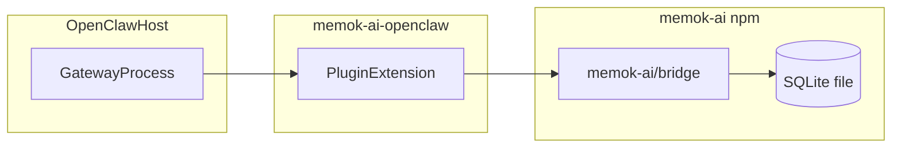
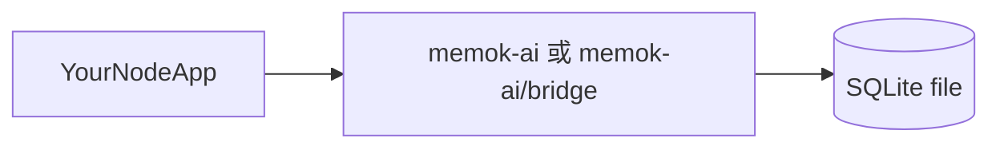

# memok-ai

[English](./README.md) | 简体中文 · 官网：[memok-ai.com](https://www.memok-ai.com/)

**Gitee 镜像（中文 / 境内安装入口）：** [gitee.com/wik20/memok-ai](https://gitee.com/wik20/memok-ai)。若你使用 fork 后的地址，请自行替换 URL。在 Gitee 网页端可将仓库 **「展示 README」** 设为 `README.zh-CN.md`，便于只阅读中文版。

**双远端推送（示例）：** `git remote add gitee https://gitee.com/wik20/memok-ai.git`（若尚未添加），之后与 GitHub 相同分支一并推送即可，例如 `git push origin main` 与 `git push gitee main`（将 `origin` / `gitee` 换成你的 remote 名）。

`memok-ai` 是一个基于 Node.js + TypeScript 的记忆流水线项目，用 OpenAI 兼容接口提取长文/对话记忆并写入 SQLite，支持召回、强化和 dreaming 流程。

**OpenClaw 网关插件（独立仓库）：** [galaxy8691/memok-ai-openclaw](https://github.com/galaxy8691/memok-ai-openclaw) — 以 npm 依赖 **`memok-ai-core`** 引用本包，并暴露稳定入口 **`memok-ai-core/bridge`**。

> **若你从插件文档跳转过来：** 一键安装脚本、`openclaw memok setup`、**网关与 plugin API 版本要求** 均在 **[memok-ai-openclaw](https://github.com/galaxy8691/memok-ai-openclaw)** 维护。**本文档**说明 **`memok-ai` npm 核心库**：SQLite 形态、`MemokPipelineConfig`，以及**你自己的 Node 进程**如何调用 `memok-ai` 或 `memok-ai/bridge`。

### 插件如何调用本核心库

网关加载扩展；扩展依赖 **`memok-ai`**（依赖名常为 `memok-ai-core`）并调用 **bridge** API。SQLite 路径仍在插件 / 宿主侧配置。



**不使用 OpenClaw**（自建 API、批处理、CLI）：



## 功能概览

- 一步式文章流水线（`article-word-pipeline`），输出稳定 JSON 二元组
- SQLite 导入工具（`words` / `normal_words` / `sentences` 及关联表）
- dreaming 编排（`dreaming-pipeline` = `predream` + story-word-sentence 多轮）
- OpenClaw 插件：对话增量落库 + 记忆召回
- 交互式插件配置（`openclaw memok setup`）

**效果验证（经测试）：** 在 OpenClaw 插件召回与上报流程下，记忆实用率（候选记忆在助手回复中被实际用到的比例）**超过 95%**（我们自测场景）。实际表现会因模型、任务与抽样参数而有所不同。

### OpenClaw 插件能帮你做什么

- 按轮召回：可在每轮回复前注入抽样候选，长对话不必每次整段粘贴历史。
- 强化：通过 `memok_report_used_memory_ids` 上报所用句 id，权重递增，常用记忆更易被抽到。
- Dreaming / predream：可选定时任务做衰减、合并与清理，更像对图做维护，而不是无限追加日志。

### 与「纯向量库」路线的差异

| | memok-ai | 常见托管向量库 |
| --- | --- | --- |
| 部署 | 本机 SQLite | 云端 API + 计费 |
| 召回依据 | 词 / 规范词图、权重、抽样 | 向量相似度 |
| 可解释性 | 结构化表可排查 | 多为相似度分数 |
| 隐私 | 默认数据不出机 | 通常需上传宿主外 |

这是取舍，不是断言检索效果一定优于或劣于向量方案。

### 来自重度使用的反馈（非基准测试）

社区与长期使用者反馈包括：跨会话跟进（性能、架构、发布流程等话题）、在明确引用记忆时上报与权重更新行为符合预期，以及 predream / 定时 dreaming 在配置后运转正常。活跃库表规模有达到约千余条句子、十万级 link 行的案例，足以验证召回在非玩具数据量下的表现；你的数据量与延迟会因磁盘、并发与配置而不同。

本机 SSD、中等库容下，单轮落库常见在约 10² ms 量级、召回查询多在百毫秒以内——仅为经验区间，不构成 SLA。网传的「召回准确率百分比」若无复现方法与数据集，宜视为轶事。

一句话：memok 追求可联想、可强化、可维护（含遗忘）的闭环，不依赖单独部署 embedding 服务或第三方向量索引，更接近「结构化笔记图」，而非通用语义检索黑盒。

## 环境要求

- Node.js **≥20**（建议 LTS）
- npm

**OpenClaw 用户：** 支持的网关与 plugin API 版本见 **[memok-ai-openclaw](https://github.com/galaxy8691/memok-ai-openclaw)** 文档（本核心仓库的 `package.json` **不再**声明 `openclaw.compat`）。

在本仓库内开发时安装依赖：

```bash
npm install
```

### 关于首次安装耗时（请先看）

首次在本仓库执行 `npm install` 的耗时主要来自 **`better-sqlite3` 等原生模块**（预编译下载或本地编译）以及其余 JS 依赖，常见 **数分钟级**（视网络与磁盘而定）。**不要用** `--loglevel verbose` 日常安装，否则日志量极大。项目根目录 **`.npmrc`** 已配置 **npmmirror** 并关闭镜像站不支持的 `audit` 请求；**中国大陆** 可继续用 Gitee 克隆本仓库以加速源码拉取。**同一 npm 缓存**下后续安装会快很多。

## 安装方法

### 1）克隆本仓库做库开发

```bash
npm install
npm run build
npm test
```

**开发流程简述**

- `npm install` — 会触发 **`prepare` → `npm run build`**（见 [package.json](package.json)），将 TypeScript 编译到 `dist/`。
- **`npm run build`** — 仅 `tsc`；若你跳过 install，改源码后需手动执行。
- **`npm test`** — Vitest；若设置了 `OPENAI_API_KEY`，部分测试会请求真实 LLM（见 [CONTRIBUTING.md](./CONTRIBUTING.md)）。
- **`npm run ci`** — Biome + build + test，与 CI 一致。

本仓库**不会**读取 `.env`；请在 shell 或编辑器环境中导出变量。

### 2）通过 npm 安装为项目依赖

npm 包名：**[`memok-ai`](https://www.npmjs.com/package/memok-ai)**（OpenClaw 插件侧可能用别名 **`memok-ai-core`**，registry 名仍为 **`memok-ai`**）。

```bash
npm install memok-ai
```

```ts
// 主入口：流水线、SQLite 工具、类型等
import {
  articleWordPipelineV2,
  buildPipelineContext,
} from "memok-ai";

// 网关 / OpenClaw 类宿主常用的稳定子集
import {
  articleWordPipeline,
  dreamingPipeline,
} from "memok-ai/bridge";
```

`memok-ai/bridge` 上的编排入口（如 `articleWordPipeline`、`dreamingPipeline`）直接接收完整的 `MemokPipelineConfig`（或 `DreamingPipelineConfig` 等扩展类型）。若需要给只认 `{ ctx }` 的低层流水线组 `ctx`，请从主包 `memok-ai` 导入 `buildPipelineContext` 并传入得到的 `PipelineLlmContext`。

```ts
import { articleWordPipeline } from "memok-ai/bridge";

await articleWordPipeline(longText, {
  dbPath: "/path/to/memok.sqlite",
  openaiApiKey: process.env.OPENAI_API_KEY!,
  openaiBaseUrl: process.env.OPENAI_BASE_URL,
  llmModel: "gpt-4o-mini",
  llmMaxWorkers: 4,
  articleSentencesMaxOutputTokens: 8192,
  coreWordsNormalizeMaxOutputTokens: 32768,
  sentenceMergeMaxCompletionTokens: 2048,
});
```

- 需要 **Node.js ≥20**（与本仓库一致）。
- 依赖 **`better-sqlite3`**（原生模块）：首次安装可能触发预编译下载或本地编译。
- **库用法**：自行组装 `MemokPipelineConfig` 并传入 bridge。

### 在你自己的 Node.js 项目中使用

1. 在你的应用里执行 **`npm install memok-ai`**（不必在本仓库内）。
2. 确定 **`dbPath`**。若要**新建空库**，可调用一次 **`createFreshMemokSqliteFile(dbPath)`**（来自 `memok-ai` 或 `memok-ai/bridge`），会创建表、`dream_logs` 与 link 索引；若文件已存在且未传 **`{ replace: true }`** 会抛错。
3. 组装 **`MemokPipelineConfig`**（字段与上文示例一致）。本库**从不**加载 `.env`；密钥请用你应用已有的方式注入（自管 `dotenv`、systemd、K8s Secret 等）。
4. 按需选择 **`memok-ai/bridge`**（稳定小面）或 **`memok-ai`**（全量导出：`articleWordPipelineV2`、`buildPipelineContext`、dreaming 子路径、`hardenDb` 等）。

| 导入 | 适用场景 |
| --- | --- |
| **`memok-ai/bridge`** | 网关、Bot 宿主、或只需文章落库 / dreaming / 召回 / 反馈 / 建库的精简服务。 |
| **`memok-ai`** | 需要 `buildPipelineContext`、仅要 v2 元组不落库、或更多 SQLite / dreaming 子模块时。 |

### 核心库 vs OpenClaw 插件

| 场景 | 建议 |
| --- | --- |
| 已使用 **OpenClaw**，需要按轮召回、上报、定时 dreaming | 安装 **[memok-ai-openclaw](https://github.com/galaxy8691/memok-ai-openclaw)**，按其 README 执行 `openclaw plugins install …`、`openclaw memok setup`；该包依赖 **`memok-ai` / `memok-ai-core`** 并调用 **`…/bridge`**。 |
| 自建 **HTTP / 队列 / CLI** 等非 OpenClaw 宿主 | 直接依赖 **`memok-ai`**（可仅用 **`memok-ai/bridge`** 收敛 API 面）。 |
| 只需 **长文写入 SQLite** | 使用 `articleWordPipeline`（bridge）即可；召回与 dreaming 可选。 |

**文档分工：** **插件仓库**写网关、安装脚本与向导；**本仓库**写 **库 API** 与 SQLite 行为。

### 端到端示例（你的项目）

以下用 **`memok-ai/bridge`** 与 `process.env` **仅作演示**；生产环境请换成你的配置来源。

```ts
// 例如 your-service/src/memokExample.ts
import {
  type MemokPipelineConfig,
  createFreshMemokSqliteFile,
  articleWordPipeline,
  extractMemorySentencesByWordSample,
  applySentenceUsageFeedback,
} from "memok-ai/bridge";

const dbPath = "./data/memok.sqlite";
createFreshMemokSqliteFile(dbPath); // 新建库时执行一次；已有库请省略（或有意使用 { replace: true } 覆盖）

const memok: MemokPipelineConfig = {
  dbPath,
  openaiApiKey: process.env.OPENAI_API_KEY!,
  openaiBaseUrl: process.env.OPENAI_BASE_URL,
  llmModel: "gpt-4o-mini",
  llmMaxWorkers: 4,
  articleSentencesMaxOutputTokens: 8192,
  coreWordsNormalizeMaxOutputTokens: 32768,
  sentenceMergeMaxCompletionTokens: 2048,
  // 可选（见 CHANGELOG.md）：
  // articleWordImportInitialWeight, articleWordImportInitialDuration,
  // dreamShortTermToLongTermWeightThreshold（供 dreamingPipeline 使用）,
};

await articleWordPipeline("长文或合并后的对话摘要 …", memok);

const recall = extractMemorySentencesByWordSample({ ...memok, fraction: 0.2 });
// 将 recall.sentences 拼进你的提示词

applySentenceUsageFeedback({
  ...memok,
  sentenceIds: recall.sentences.map((s) => s.id),
});
```

若只要 **v2 元组而不写库**，请改用主包 **`articleWordPipelineV2`** + **`buildPipelineContext`**。

### 3）作为 OpenClaw 插件使用

**请以插件仓库为准：**

- 一键脚本、`openclaw memok setup`、兼容矩阵与排障说明均在 **[memok-ai-openclaw](https://github.com/galaxy8691/memok-ai-openclaw)**。
- 本 **memok-ai** 仓库是**被依赖的核心库**；旧文档若指向本仓库下的 `scripts/` 路径，**可能随分支变化而失效**，请以 **插件 README** 中的链接为准。

示意（细节见插件文档）：

```bash
git clone https://github.com/galaxy8691/memok-ai-openclaw.git
cd memok-ai-openclaw
# 按插件 README：openclaw plugins install … && openclaw memok setup
```

## Dreaming

从 **`memok-ai/bridge`** 调用 **`dreamingPipeline`**，传入 **`DreamingPipelineConfig`**（在 `MemokPipelineConfig` 基础上必填 **`dreamLogWarn`**，可选 `maxWords` / `fraction` / `minRuns` / `maxRuns`）。OpenClaw 插件在同一核心函数之上配置定时任务。

### 落库与监控

- 每次执行结束（**成功或失败**）都会在 SQLite **`dream_logs`** 追加一行：`dream_date`、`ts`、`status`（`ok` / `error`）、**`log_json`**（完整 JSON：含 predream 统计、story 汇总；失败时含 `error` 等字段）。
- 实现 **`dreamLogWarn`**，用于记录或上报**非致命**问题（例如 `dream_logs` 写入失败）；严重错误仍会在记录后抛出。

### 调试建议

1. 只读打开数据库：`SELECT * FROM dream_logs ORDER BY id DESC LIMIT 5;`
2. 关注 **`status = 'error'`** 行，查看 **`log_json`** 中的错误信息。
3. 对比多次运行的 **`log_json`**，确认 predream / story 段是否符合预期。

## 配置优先级说明（OpenClaw 插件）

对 `OPENAI_API_KEY`、`OPENAI_BASE_URL`、`MEMOK_LLM_MODEL`（使用独立 OpenClaw 插件时）：

1. 进程已有环境变量优先
2. 插件配置仅补齐缺失值，不覆盖已有值

本核心库**从不**加载 `.env`；密钥请通过进程管理器或网关注入。

## 环境变量

### 谁会读这些变量？

1. **OpenClaw 插件进程** — 可能在组装配置时用 `MEMOK_*` 填默认值（见上一节优先级）。
2. **本仓库测试 / 遗留路径** — 在未显式传入 `MemokPipelineConfig` 时，仍可能从 `process.env` 读取分阶段覆盖。
3. **库集成方** — 生产环境应**显式构造 `MemokPipelineConfig`**，**不要依赖**下表作为唯一配置源。

| 变量 | 是否必填 | 存在原因 | 生效时 |
| --- | --- | --- | --- |
| `OPENAI_API_KEY` | 走 env 组装时必填 | 调用兼容 OpenAI 的 API | 从环境组装配置时使用。 |
| `OPENAI_BASE_URL` | 否 | 自建网关 / 代理 | 覆盖默认 OpenAI 主机。 |
| `MEMOK_LLM_MODEL` | 否 | 快速切换默认模型 | 未在配置对象中指定模型时的回退。 |
| `MEMOK_DB_PATH` | 否 | 快速默认库路径 | 默认 `./memok.sqlite`（env 组装路径时）。 |
| `MEMOK_LLM_MAX_WORKERS` | 否 | 限制并行 LLM 调用 | 大于 1 时在文章流水线等阶段启用有界并行。 |
| `MEMOK_V2_ARTICLE_SENTENCES_MAX_OUTPUT_TOKENS` | 否 | 限制文章句阶段输出 | 有上下限的 token 上限。 |
| `MEMOK_CORE_WORDS_NORMALIZE_MAX_OUTPUT_TOKENS` | 否 | 限制规范化阶段输出 | 有上下限的 token 上限。 |
| `MEMOK_SENTENCE_MERGE_MAX_COMPLETION_TOKENS` | 否 | 限制合并补全长度 | 有上下限的 token 上限。 |
| `MEMOK_SKIP_LLM_STRUCTURED_PARSE` | 否 | 调试 / 容错 | 为真时跳过部分严格结构化解析。 |

各阶段专用模型等环境变量名见源码中 `resolveModel` 等辅助函数。

## 贡献指南

欢迎提交贡献。详细规范请见：[CONTRIBUTING.md](./CONTRIBUTING.md)。

## 许可证

本项目采用 [MIT 许可证](LICENSE)。
